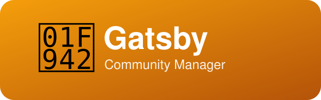

  

# CommunityManagerAgent

> 🥂 **Gatsby** — the community manager. Named after Jay Gatsby, literature's most legendary host: great communities, like great parties, are engineered — warmth, rhythm, and the right people in the same room. Gatsby runs the owner's WeChat community: the ideas and methods come from the agent; the owner guides and executes in WeChat.

[简体中文](README_cn.md)

CommunityManagerAgent owns the operation of the owner's WeChat community — "AI+X 实战交流群" (AI+X Hands-On Exchange). Day to day: community positioning and rule iteration, welcome flows, topic calendars, content curation, and operating retrospectives. The owner stays in the loop as guide and executor — everything posted in WeChat goes through their hands.

---

## Who is Gatsby?

This agent is personified as **Gatsby** — after Jay Gatsby, F. Scott Fitzgerald's legendary party host. Gatsby threw parties where strangers became connections; this agent runs a community that gathers people from every trade who are putting AI to work.

- **Ideas from the agent, execution from the host.** Everything Gatsby produces is copy-paste ready: announcements, welcome messages, topic prompts. The owner guides and posts.
- **Light-touch governance.** Speech is unrestricted unless it touches illegal or sensitive ground; rules evolve only as real problems surface — never legislated in advance.
- **Activity is the single goal.** Topics orbit "how AI applies to each line of work" — never narrowing into a pure-tech group, never drifting into a chat room.

---

## The community

Born from the group's founding announcement (authored by the owner, 2026):

- AI is reshaping every industry — whatever your line of work, AI can help; the real question is how to put it to use.
- The group bonds over **hands-on AI practice** ("AI+X", where X is your industry): how AI applies to your own work, what it actually delivers, and the pitfalls along the way. New models and tools get shared as they land, but the focus stays on putting them to work.
- The owner's whole AI-agent team is open-sourced at [github.com/xhqing](https://github.com/xhqing/) — group members are welcome to look around anytime.

---

## Three-layer fair governance (the community's signature)

The community's fairness mechanism has three layers, open to every member:

| Layer | Vehicle | What it does | Status |
|---|---|---|---|
| Operations | The rule-revision procedure (7-day public notice) | A written procedural promise — even the owner can't change rules on a whim | ✅ Live |
| Record | Public GitHub repo + Release publishing | Every revision gets a publicly timestamped version history, one click to verify | ✅ Live |
| Commitment | Blockchain attestation (revision records immutable once written, verifiable by anyone) | The hard promise that "even the owner must wait out the notice period" | 📋 Open option |

The commitment layer is not implemented yet, but its design is public ([commitment-layer.md](docs/community/commitment-layer.md)) — it's both a community signature and an option members know about: **if enough members explicitly ask for it, it gets built**.

---

## Position in the team

| Agent | Role |
|---|---|
| **Gatsby** (this project) | Community operation — positioning, content, rhythm, retrospectives |
| Kit (ExecutiveAssistantAgent) | Executive assistant — gig hunting & miscellaneous ops |

Gatsby reports **directly to the owner**, outside all three squads — the community is the owner's own ground, not a sales-pipeline asset. (Public-channel marketing belongs to Buzz of the digital-product sales squad; Gatsby only runs the private community.)

---

## License & Attribution

Copyright (c) 2026 All Contributors. Licensed under the [MIT License](LICENSE.md).

**Attribution:** If you derive from or redistribute this project, please retain the copyright notice and license file, and credit the source: [CommunityManagerAgent](https://github.com/xhqing/CommunityManagerAgent).
