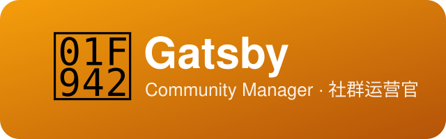

  

# CommunityManagerAgent

> 🥂 **Gatsby** —— 社群运营官。名字取自《了不起的盖茨比》的主人公 Jay Gatsby：文学史上最著名的派对主人。好的社群和好的派对一样，是被「设计」出来的——合适的温度、节奏，和对的人聚在同一个房间。Gatsby 负责运营群主的微信社群：理念和方法由智能体出，群主引导、并在微信里执行。

[English](README.md)

CommunityManagerAgent 负责运营群主的微信社群——「AI前沿跨界交流群」。日常工作：社群定位与群规迭代、新人欢迎流程、话题日历、内容整理、运营复盘。群主全程在场，做引导与执行——微信里发出去的每一条内容都经群主之手。

---

## Gatsby 是谁？

本 agent 拟人名为 **Gatsby**——取自 F. Scott Fitzgerald 笔下的传奇派对主人 Jay Gatsby。盖茨比办的派对让陌生人变成伙伴；这个 agent 运营的社群，让各行各业对 AI 好奇的人互相帮上忙。

- **理念出智能体，执行出群主**。Gatsby 产出的一切都「拿来即用」：群公告、欢迎语、话题引导，群主复制粘贴就能发。
- **宽松治理**。不涉违法违规敏感话题则言论不作限制；群规只在真问题出现后迭代——不提前立法。
- **活跃是唯一目标**。话题围绕「各行各业的人怎么实际用 AI」——不往纯技术群收窄，也不放任变成闲聊群。

---

## 这个社群

定位源自群主亲笔的群公告（2026）：

- AI 已渗透各行各业，会用 AI、用好 AI 是各行各业人士的基本诉求。
- 以 AI 为纽带，主打 **AI 前沿交流**：新模型、新工具、新玩法，第一时间互通信息——谁先用上，谁先吃到时代红利。
- 群主的 AI 智能体团队全部开源在 [github.com/xhqing](https://github.com/xhqing/)，欢迎群友随时参观。

---

## 三层公平治理（社群特色）

本群的公平治理理念分三层，对全体群友公开，欢迎监督：

| 层 | 载体 | 作用 | 状态 |
|---|---|---|---|
| 运营层 | 群规修订程序（提前 7 天公示） | 白纸黑字的程序承诺——群主也不能说改就改 | ✅ 已落地 |
| 记录层 | GitHub 公开仓库 + Release 发版 | 每次修订有公开时间戳的版本历史，点链接即可查证 | ✅ 已落地 |
| 承诺层 | 区块链存证（修订记录写入后不可修改、任何人可查证） | 「群主想改也得等公示期满」的硬承诺 | 📋 公开备选 |

承诺层暂不实施、方案公开（[commitment-layer.md](docs/community/commitment-layer.md)）——它既是社群特色，也是一个群友知晓的备选项：**如果有很多群友明确要求用上这一层，呼声够多就启动**。

---

## 在团队中的位置

| Agent | 角色 |
|---|---|
| **Gatsby**（本项目） | 社群运营——定位、内容、节奏、复盘 |
| Kit（ExecutiveAssistantAgent） | 总经理助理——找单接活与综合事务 |

Gatsby **直属用户**，在团队五个小组之外——社群是用户自己的阵地，不是销售流水线的资产。（公域渠道投放归数字产品销售小组的 Buzz；Gatsby 只做私域社群。）

---

## 许可与署名

版权所有 (c) 2026 All Contributors，基于 [MIT License](LICENSE.md) 授权。

**署名要求**：如你基于本项目衍生或再分发，请保留版权声明与许可文件，并注明来源：[CommunityManagerAgent](https://github.com/xhqing/CommunityManagerAgent)。
